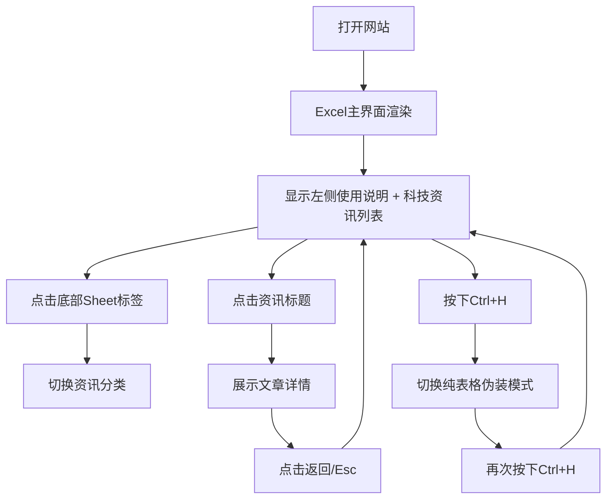

## 1. 产品概述

Excel摸鱼神器 - 一款伪装成Excel电子表格的资讯浏览网站，帮助用户在工作间隙低调获取各类资讯。
- 核心目的：通过高度仿真的Excel界面伪装，让用户在办公环境下安全浏览资讯，避免被察觉
- 目标用户：办公室白领、程序员、学生等需要在工作/学习中低调获取资讯的人群

## 2. 核心功能

### 2.1 功能模块

1. **Excel主界面**：标题栏、功能区、名称框、公式栏、行号列标、单元格网格、底部Sheet标签栏
2. **左侧帮助面板**：以"使用说明"Sheet形式呈现，包含快捷键指南、操作说明、功能介绍
3. **右侧资讯展示区**：以单元格内容形式展示资讯列表，点击进入详情
4. **Sheet分类切换**：底部Sheet标签切换不同资讯分类（科技、军事、财经、娱乐、体育等）
5. **老板键/快速隐藏**：快捷键一键隐藏资讯内容，切换到纯表格伪装模式
6. **资讯详情页**：弹窗或全屏展示文章完整内容，保持Excel风格

### 2.2 页面详情

| 页面名称 | 模块名称 | 功能描述 |
|---------|---------|---------|
| 主界面 | Excel标题栏 | 展示文件名"年度财务报表.xlsx"、最小化/最大化/关闭按钮（装饰用） |
| 主界面 | 功能区 | 开始/插入/页面布局/公式/数据/审阅/视图选项卡，样式工具按钮（装饰+部分可用） |
| 主界面 | 名称框+公式栏 | 显示当前单元格位置，可输入公式伪装 |
| 主界面 | 行号列标 | A,B,C...列标 + 1,2,3...行号，可选中高亮 |
| 主界面 | 单元格网格 | 左侧显示使用说明内容，右侧显示资讯列表/详情 |
| 主界面 | Sheet标签栏 | Sheet1(使用说明)、科技、军事、财经、娱乐、体育 + 新建按钮 |
| 资讯列表 | 热文列表 | 序号、标题、来源、热度、发布时间，点击打开详情 |
| 资讯详情 | 文章展示 | 标题、作者、发布时间、正文内容、返回按钮 |
| 帮助面板 | 快捷键说明 | Ctrl+H 隐藏/切换、Ctrl+←/→ 切换分类、Esc 返回列表 |
| 帮助面板 | 使用说明 | 如何切换分类、如何查看详情、伪装技巧提示 |

## 3. 核心流程

用户打开网站 → 默认显示左侧使用说明 + 右侧科技资讯列表 → 通过底部Sheet标签切换分类 → 点击资讯标题查看详情 → 按下Ctrl+H快速切换到伪装模式（纯空白表格） → 再次按下恢复浏览

## 4. 用户界面设计

### 4.1 设计风格
- **主色调**：Excel经典绿(#217346)作为功能区背景，白色单元格背景，浅灰网格线
- **辅助色**：选中单元格蓝色边框(#1E6EB8)，Sheet标签激活态绿色
- **按钮样式**：扁平风格，悬停显示浅灰背景，激活显示淡蓝色背景
- **字体**：Calibri / "Microsoft YaHei" 11号，模拟Excel默认字体
- **布局风格**：严格模拟Excel 2016/2019界面布局，顶部功能区 → 公式栏 → 主内容区 → 底部Sheet栏 + 状态栏
- **图标/emoji**：使用纯色SVG图标模拟Office风格工具栏图标

### 4.2 页面设计概述

| 页面名称 | 模块名称 | UI元素 |
|---------|---------|-------|
| 主界面 | 功能区 | 绿色顶部背景、白色选项卡文字、悬停浅绿高亮、选中白色背景带绿色下划线 |
| 主界面 | 单元格网格 | 1px浅灰边框(#D4D4D4)、选中单元格蓝色粗边框、斑马纹可选 |
| 主界面 | Sheet标签 | 灰底黑字、激活白底黑字带绿色顶部边框、悬停浅灰 |
| 资讯列表 | 列表行 | 悬停浅蓝背景(#E8F0FE)、标题蓝色可点击、热度数字红色标注 |
| 资讯详情 | 详情页 | 弹窗模式带白色背景灰色边框、标题大号加粗、正文行高1.8舒适阅读 |
| 伪装模式 | 纯表格 | 随机填充财务数据样式内容(销售额/利润/季度等)、完全真实Excel观感 |

### 4.3 响应性
- 桌面端优先设计，严格保证1280px及以上分辨率完美显示
- 中等分辨率(1024-1279px)适当压缩功能区按钮间距
- 移动端自动适配，简化功能区显示，保证核心浏览功能
- 所有单元格内容支持文字溢出省略，保持表格整洁

### 4.4 交互动效
- Sheet切换：0.2s淡入淡出过渡
- 资讯详情打开/关闭：0.3s缩放+透明度动画
- 伪装模式切换：瞬间切换无动画（防止察觉）
- 单元格选中：即时蓝色边框高亮
- 按钮悬停：0.1s背景色渐变
