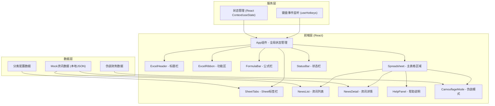

## 1. 架构设计



## 2. 技术说明

- **前端框架**: React@18 + TypeScript
- **构建工具**: Vite@6
- **样式方案**: TailwindCSS@3 (原子化CSS) + CSS Variables (主题色)
- **状态管理**: React Context + useReducer (全局状态: 当前Sheet、伪装模式、详情页开关)
- **键盘监听**: 自定义 useHotkeys Hook
- **字体**: Calibri, "Microsoft YaHei", "PingFang SC" (系统字体优先，无需额外引入)
- **数据来源**: 本地Mock数据，内置多个分类的示例资讯内容
- **无需后端**: 纯前端单页应用，所有数据本地存储

## 3. 组件层级与路由

| 组件路径 | 组件名称 | 职责说明 |
|---------|---------|---------|
| / | App.tsx | 根组件，全局状态管理，键盘事件注册 |
| /components | ExcelHeader.tsx | 标题栏（文件名、窗口控制按钮） |
| /components | ExcelRibbon.tsx | 功能区（选项卡 + 工具栏按钮组） |
| /components | FormulaBar.tsx | 名称框 + 公式栏 |
| /components | Spreadsheet.tsx | 主表格区域容器（行号列标 + 单元格网格） |
| /components | SheetTabs.tsx | 底部Sheet标签切换栏 |
| /components | StatusBar.tsx | 底部状态栏 |
| /components | HelpPanel.tsx | 左侧使用说明/快捷键面板 |
| /components | NewsList.tsx | 资讯热文列表组件 |
| /components | NewsDetail.tsx | 资讯详情弹窗组件 |
| /components | CamouflageMode.tsx | 伪装模式财务表格 |
| /contexts | AppContext.tsx | 全局状态Context定义 |
| /hooks | useHotkeys.ts | 键盘快捷键Hook |
| /data | newsData.ts | Mock资讯数据 |
| /data | categories.ts | 资讯分类配置 |
| /data | camouflageData.ts | 伪装财务数据 |
| /types | index.ts | TypeScript类型定义 |

## 4. 全局状态定义 (TypeScript)

```typescript
interface AppState {
  activeSheet: string;           // 当前激活的Sheet ID
  isCamouflageMode: boolean;     // 是否伪装模式
  showDetail: boolean;           // 是否显示详情
  selectedNewsId: number | null; // 当前选中的资讯ID
  selectedCell: { row: number; col: string } | null;
  formulaBarValue: string;
}

interface NewsItem {
  id: number;
  category: string;    // 对应分类ID
  title: string;
  source: string;
  author: string;
  hot: number;         // 热度值
  publishTime: string;
  summary: string;
  content: string;     // 正文HTML
}

interface Category {
  id: string;
  name: string;        // Sheet显示名
  icon: string;        // 可选图标
}
```

## 5. 核心功能实现方案

### 5.1 Excel仿真界面
- 功能区(Ribbon): 使用Flex布局，Tab切换显示不同按钮组，纯UI展示为主
- 表格网格: CSS Grid布局实现A-Z列标 + 1-100+行号
- Sheet标签: 横向滚动容器，支持新建Sheet(装饰)
- 状态栏: 显示"就绪"、求和/计数(装饰数据)

### 5.2 资讯分类与切换
- 底部Sheet标签 = 资讯分类入口
- 切换Sheet → 更新activeSheet → NewsList根据category过滤数据

### 5.3 伪装模式 (老板键)
- 监听 Ctrl+H / Command+H (兼容Mac)
- isCamouflageMode=true时: 隐藏HelpPanel+NewsList，渲染CamouflageMode组件
- 页面title同步切换为"年度财务报表.xlsx - Excel"
- 再次按快捷键恢复

### 5.4 快捷键映射
| 快捷键 | 功能 |
|-------|------|
| Ctrl/Command + H | 切换伪装模式 |
| Ctrl/Command + ← | 上一个分类 |
| Ctrl/Command + → | 下一个分类 |
| Esc | 关闭详情页 / 退出伪装模式(可选) |
| Ctrl/Command + 1~6 | 快速切换第N个分类 |

### 5.5 响应式适配
- 桌面端(≥1280px): 左侧帮助面板(40%) + 右侧资讯(60%)
- 中等屏幕(1024-1279px): 功能区简化，帮助面板35%
- 移动端(<1024px): 功能区极简，帮助面板可折叠，资讯区域最大化

## 6. 性能与体验优化

1. **纯前端渲染**: 无网络请求，秒开
2. **懒加载内容**: 资讯详情内容按需渲染
3. **CSS动画硬件加速**: transform/opacity属性实现平滑过渡
4. **防抖处理**: 搜索/输入类操作防抖(如公式栏输入)
5. **内存优化**: 大列表采用虚拟化渲染(可选，若超过50条)
